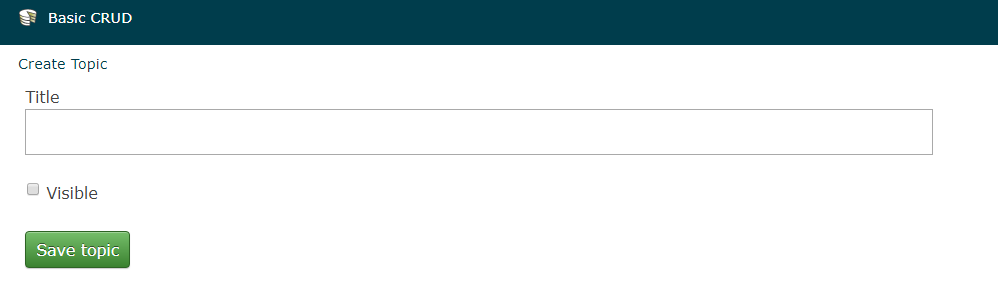
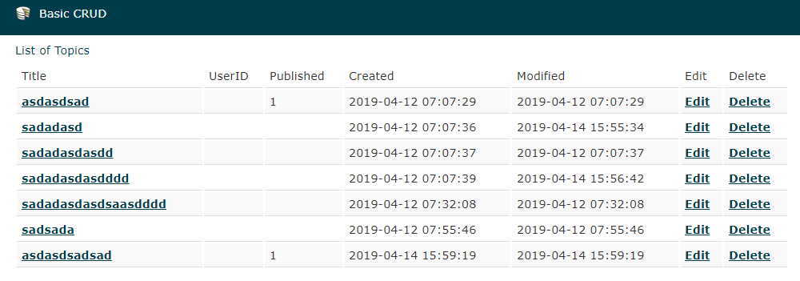
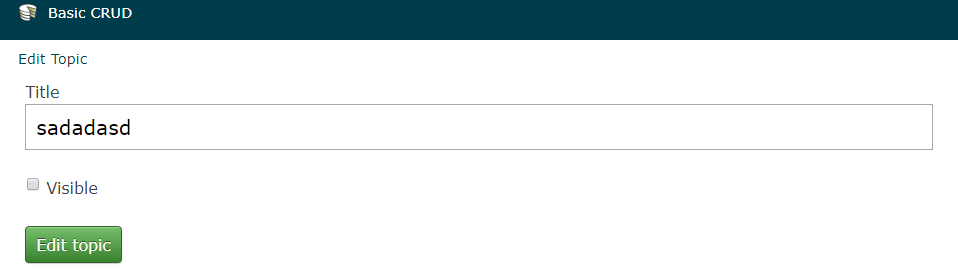
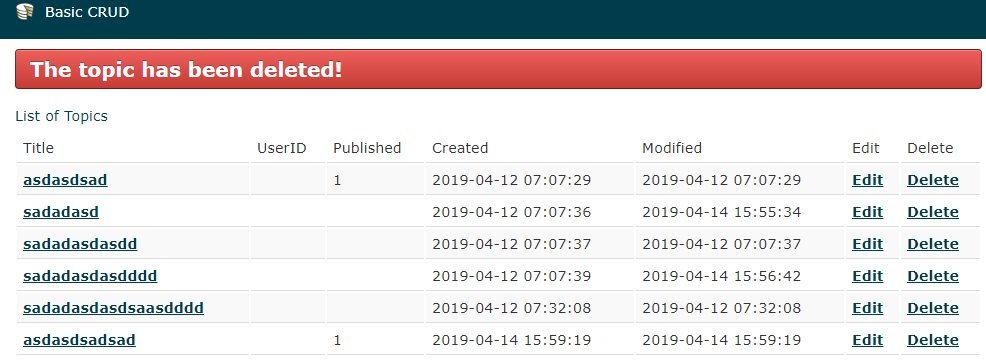

# CakePHP CRUD

## Version
CakePHP `v2.10`

# Operations  

* `Create` <i style="color:gray">a topic</i>  
	** Go to this page `{website}/topics/add`    
* `Read` <i style="color:gray">(display all topics && display a topic)</i>  
	** Go to this page `{website}/topics/index`    
* `Update` <i style="color:gray">a topic</i>    
* `Delete` <i style="color:gray">a topic</i>    
  
# UI

## Create `{website}/topics/add`  
   

## Read `{website}/topics/index`  
   

## Update  
   

## Delete  
 

CakePHP 2.5.4 Basics Tutorial for Beginners    
https://www.youtube.com/watch?v=2mvpLqJVW7c&list=PLy6f6YeaisJLnQpKpeeJX_ooJg_IH1Oib&index=1  